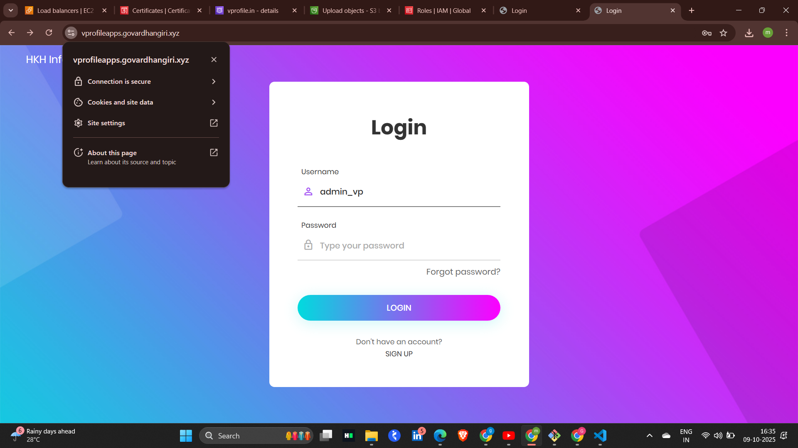

# 🚀 AWS Lift-and-Shift Project – Cloud Migration Architecture

This project demonstrates the Lift-and-Shift migration strategy, where a traditional on-premise web application is migrated into the AWS Cloud without redesigning the core architecture.  
The setup includes a 3-tier architecture with Auto Scaling, Load Balancing, Secure Networking, and CI/CD integration using Maven and S3.

---

## 🧩 Architecture Diagram

---

## 🏗️ Project Components

### 1️⃣ Frontend Access (DNS & Routing)
- Domain registered on GoDaddy  
- Managed through AWS Route 53  
- Custom domain linked to the Application Load Balancer (ALB)  

### 2️⃣ Load Balancer & Auto Scaling
- Application Load Balancer (ALB) handles incoming HTTPS traffic  
- Auto Scaling Group (ASG) dynamically manages EC2 instances for high availability  

### 3️⃣ Application Tier
- EC2 instances run the Java web app deployed on Apache Tomcat  
- Maven used to package and deploy `.war` files from S3 artifacts  

### 4️⃣ Backend Components
- MySQL for database management  
- Memcache for caching frequently accessed data  
- RabbitMQ for asynchronous message queue handling  

### 5️⃣ Storage & IAM
- Amazon S3 used for storing static files and build artifacts  
- IAM Roles securely manage service permissions  

### 6️⃣ Security & Monitoring
- Security Groups enforce network access control  
- Private Subnets secure backend communication  
- CloudWatch monitors instance health and performance metrics  

---

## ⚙️ Tools & Technologies Used

| Category | Tools |
|----------|-------|
| Cloud Provider | AWS |
| Compute | EC2, Auto Scaling |
| Networking | Route 53, ALB, Security Groups |
| Storage | S3 |
| Database & Messaging | MySQL, Memcache, RabbitMQ |
| DevOps | Maven, IAM |
| Monitoring | CloudWatch |

---

## 📊 Project Flow

User → GoDaddy Domain → Route 53 → ALB → Tomcat Instances → MySQL/Memcache/RabbitMQ → S3 → IAM Roles → CloudWatch  

---

## 🌐 Key Features

- ✅ Scalable architecture using Auto Scaling  
- ✅ Highly available via Load Balancer  
- ✅ Secure networking with private subnets  
- ✅ Cost-efficient and production-ready setup  
- ✅ End-to-end AWS-managed services  

---

## 📸 Project Output

  
.png)

> **Tip:** If you don’t want to commit images, you can use GitHub’s “Drag & Drop” upload in issues, copy the link, and use `?raw=true` at the end.

---

## 🧠 Learning Outcomes

- Hands-on understanding of Lift-and-Shift migration strategy  
- Built and automated AWS-based architecture  
- Experience with Tomcat deployments, IAM, and Security Groups  

---

## 💡 Future Improvements

- Add CI/CD pipeline using Jenkins and GitHub Actions  
- Integrate CloudFormation or Terraform for infrastructure automation  
- Enable CloudFront CDN for global content delivery  

---

## 👨‍💻 Author

**Mula Govardhan Reddy (Giri)**  
📍 DevOps & Cloud Enthusiast  
🔗 [LinkedIn Profile](https://www.linkedin.com/in/your-linkedin)  

